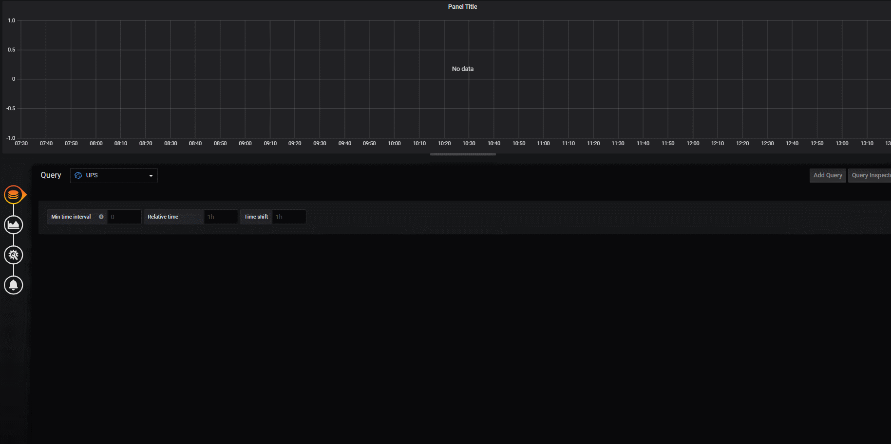

# influxdb_nut_exporter
Dockerised Python script to send metrics from Network UPS Tools to Grafana

## Getting started

Grab the example config above, and edit to suit your environment

## Configuration within config.ini

#### GENERAL
|Key            |Description                                                                                                         |
|:--------------|:-------------------------------------------------------------------------------------------------------------------|
|Delay          |Delay between updating metrics                                                                                      |
|ReportCombined |When using multiple servers report total streams over all servers                                                   |
#### INFLUXDB
|Key            |Description                                                                                                         |
|:--------------|:-------------------------------------------------------------------------------------------------------------------|
|Address        |Host running influxdb                                                                                               |
|Port           |InfluxDB port to connect to.  8086 in most cases                                                                    |
|Database       |Database to write collected stats to                                                                                |
|Username       |User that has access to the database                                                                                |
|Password       |Password for above user                                                                                             |
|Verify_SSL     |Disable SSL verification for InfluxDB Connection                                                                    |
#### NUT
|Key            |Description                                                                                                         |
|:--------------|:-------------------------------------------------------------------------------------------------------------------|
|Server         |Host running Network UPS Tools                                                                                      |
|UPSName        |This is the name of the UPS (configured on NUT Server)                                                              |
|Username       |User that has access to monitor NUT Server                                                                          |
|Password       |Password for above user                                                                                             |
#### LOGGING
|Key            |Description                                                                                                         |
|:--------------|:-------------------------------------------------------------------------------------------------------------------|
|Level          |Minimum type of message to log.  Valid options are: critical, error, warning, info, debug                           |

## Docker

### Docker run

```
 docker run --name influxdb_nut_exporter -v /path/to/config/config.ini:/app/config.ini:ro brycech/influxdb_nut_exporter

```
### Docker Compose

```
  version: '2'
  services:
    ups:
      image: brycech/influxdb_nut_exporter
      container_name: influxdb_nut_exporter
      volumes:
        - /path/to/config/config.ini:/app/config.ini:ro
      restart: always
```
## Grafana

Add influxdb database to Grafana and graph away

[Fully compatible with this dashboard](https://grafana.com/grafana/dashboards/10914)


